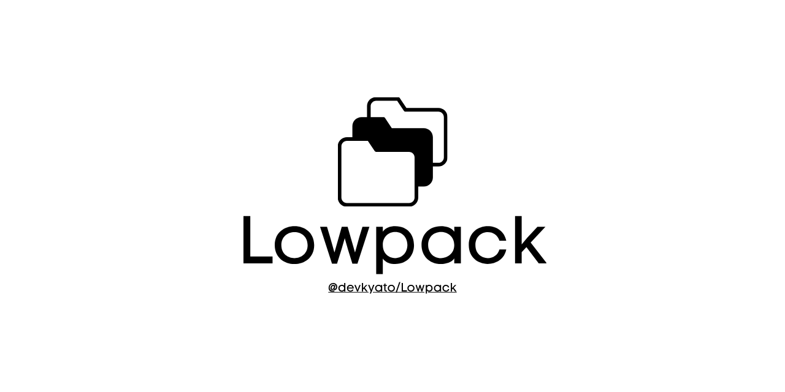

# LowPack



[](https://github.com/devkyato/Lowpack/actions/workflows/ci.yml)
[](https://github.com/devkyato/Lowpack/releases)
[](https://github.com/devkyato/Lowpack/actions)
[](LICENSE)
[](https://doi.org/10.5281/zenodo.21853277)

I built LowPack around one fairly simple thought: compression should understand
what it is packing before it reaches for a codec. LowPack prepares data for how
it will actually be stored and used, then hands it to proven lossless codecs.
It is a terminal tool and Python library that stays completely on your laptop.

> **A quick, honest alpha note:** the `.lpk` format is still experimental.
> LowPack 0.2.3 can migrate format 1.0 archives made by the 0.1 releases, but
> please do not make any alpha archive the only copy of important data.

Oh! One point I care about being clear on: LowPack does **not** universally
outperform Zstandard, gzip, ZIP, Brotli, LZ4, or anything else. Results depend
on the data, policy, codec versions, and machine. Version 0.2 uses store, zlib,
and Zstandard underneath. The LowPack part is deterministic packaging, safe
indexing, deduplication, explainable selection, and reversible preparation.

## Install

Python 3.9 through 3.14 is supported. To use LowPack today, install the wheel
attached to the GitHub release:

```powershell
python -m venv .venv
.venv\Scripts\Activate.ps1
python -m pip install "https://github.com/devkyato/Lowpack/releases/download/v0.2.3/lowpack-0.2.3-py3-none-any.whl"
lowpack --version
lowpack doctor
```

On macOS or Linux, activation is `source .venv/bin/activate`; the install
command is otherwise the same. If I want the terminal command isolated from a
project, I use `pipx install` with that wheel URL instead. Each release also
includes `SHA256SUMS`, the source archive, and exact verification notes. The
[getting-started guide](docs/getting-started.md) covers installation,
upgrades, a first round trip, and common command-not-found fixes.

For development, clone the repository and use
`python -m pip install -e ".[dev]"` in a fresh environment. That keeps the
published install path separate from contributor tooling.

That is it. LowPack needs no account, website, cloud service, daemon, database,
analytics, or background network access.

## Five-minute demonstration

Here is the shortest useful tour I use when I want to see the full flow:

```powershell
lowpack pack project -o project.lpk --profile source
lowpack list project.lpk
lowpack inspect project.lpk
lowpack verify project.lpk --full
lowpack explain project.lpk
lowpack unpack project.lpk -o restored
```

The exact sizes depend on the input, but a successful run reports the archive,
its verification status, and restored file count in this form:

```text
Packed 42 files to project.lpk
OK
Extracted 42 files
```

Selective extraction is `lowpack extract project.lpk project/src -o selected`.
I made `--overwrite` explicit on purpose, and `lowpack doctor` is there when
you want a quick check of the local environment.

If an archive came from LowPack 0.1, migrate it without touching the original:

```powershell
lowpack compatibility old-project.lpk
lowpack migrate old-project.lpk -o project-1.1.lpk
lowpack verify project-1.1.lpk --full
```

Oh! On this part I thought the safest upgrade was the least surprising one:
LowPack authenticates the old archive, rewrites only the framing and manifest,
fully reconstructs and verifies the migrated temporary archive, and moves it
into place only after all of that succeeds. See the
[compatibility guide](docs/compatibility.md).

Codec selection uses deterministic policy names: `balanced`, `smallest`,
`prefer-store`, `prefer-zstd-low`, and `avoid-zlib`. They describe stable
preferences rather than claiming to measure whole-machine speed or memory.

## How I think about profiles

- `general` is the honest default. It samples codecs without changing content,
  detects common compressed formats by magic bytes, chunks files, and
  deduplicates identical chunks. It never silently excludes ordinary files.
- `source` is what I use for project trees. It keeps bytes unchanged, records
  a language/category manifest, and
  excludes a documented set of build/cache paths unless `--include-all` is
  used. Every exclusion is printed and stored.
- `telemetry` is the more structured path for CSV. `--telemetry-mode exact`
  (the default) preserves
  byte-for-byte content. `canonical` separates columns, records inferred types
  and reversible encodings, and reconstructs deterministic RFC-style CSV; it
  is semantically rather than byte equivalent.

See [profile details](docs/profiles.md) and
[telemetry details](docs/telemetry-format.md).

## Determinism

I thought about the “same input, same archive” point early because reproducible
output is much easier to trust and test. LowPack omits creation time and
unstable filesystem metadata, sorts paths and manifest keys, uses canonical
JSON, and writes in a stable order. Identical bytes still require identical
inputs, normalized paths, metadata policy, LowPack and codec versions/settings,
profile/transform settings, chunk size, and platform-independent options.

```powershell
lowpack pack source -o first.lpk
lowpack pack source -o second.lpk
lowpack verify-deterministic first.lpk second.lpk
```

See [determinism guarantees](docs/determinism.md).

## Security

Archive extraction is the part I refuse to treat casually. LowPack rejects
traversal, absolute/drive/UNC/NUL paths, duplicate and case-colliding
destinations, unknown codecs, invalid sizes, unsafe parent symlinks, and
archives over conservative limits. Ordinary files are verified and extracted
one chunk at a time through sibling temporary files before atomic replacement.
Canonical telemetry is explicitly capped because its v1 transform still needs
an in-memory reconstruction. Archived permissions are restored only when
`--restore-permissions` is requested, and special mode bits are never applied.
Symlinks are neither packed by default nor restored.

Untrusted archives should always be extracted with limits and full
verification. Review [the security model](docs/security.md) and report
vulnerabilities according to [SECURITY.md](SECURITY.md).

## Benchmarking

I wanted the benchmark command to be useful even when LowPack loses. It uses a
warm-up, repeated monotonic-clock runs, and environment metadata; it does not
tune results to favor LowPack. Generate the fixed-seed local corpus with
`python benchmarks/generate_corpus.py`, then run
`lowpack benchmark corpus --json results.json --markdown benchmark.md`.
Nothing is downloaded.

The table below is populated only by a real release-check run:

<!-- BENCHMARK_START -->
# LowPack benchmark

Python 3.14.4 on Windows-11-10.0.26200-SP0 (AMD64); 1 warm-up, 3 measured runs. Fixed-seed generated corpus.

| Scope | Method | Original | Packed | Ratio | Encode ms | Decode ms |
|---|---|---:|---:|---:|---:|---:|
| raw-payload | store | 1660822 | 1660822 | 1.000 | 0.002 | 0.001 |
| raw-payload | gzip-6 | 1660822 | 871185 | 0.525 | 28.793 | 1.724 |
| raw-payload | zstd-1 | 1660822 | 839013 | 0.505 | 1.897 | 1.477 |
| raw-payload | zstd-3 | 1660822 | 840484 | 0.506 | 2.683 | 1.054 |
| raw-payload | zstd-9 | 1660822 | 835586 | 0.503 | 14.718 | 1.458 |
| tar-container | tar+gzip-6 | 1660822 | 873570 | 0.526 | 34.889 | 17.429 |
| tar-container | tar+zstd-1 | 1660822 | 842537 | 0.507 | 2.948 | 16.010 |
| tar-container | tar+zstd-3 | 1660822 | 843799 | 0.508 | 2.943 | 15.226 |
| tar-container | tar+zstd-9 | 1660822 | 838402 | 0.505 | 16.133 | 18.423 |
| full-archive | lowpack-general | 1660822 | 973489 | 0.586 | 306.051 | 1136.959 |
| full-archive | lowpack-source | 1660822 | 982141 | 0.591 | 439.086 | 1030.350 |
<!-- BENCHMARK_END -->

See [benchmark methodology](docs/benchmarking.md). Measurements apply only to
the identified corpus and environment.

## Python API

```python
from lowpack import (
    inspect_archive,
    migrate_archive,
    pack,
    probe_compatibility,
    unpack,
    verify_archive,
)

pack(["project"], "project.lpk", profile="source", goal="balanced")
info = inspect_archive("project.lpk")
assert verify_archive("project.lpk", full=True).valid
unpack("project.lpk", output="restored")

# For a 0.1 archive:
probe_compatibility("old-project.lpk")
migrate_archive("old-project.lpk", "project-1.1.lpk")
```

Functions return typed frozen result models.

## Limitations

This is where I would rather be specific than sound finished too early. The
format has no forward-compatibility promise during alpha. Version 0.2
deliberately introduced manifest schema 2 after the 0.1 security review;
0.2.3 provides a checked migration from format 1.0. Source dictionaries
use bounded deterministic samples and only apply to Zstandard chunks.
Telemetry canonical mode stores exact IEEE-754 values, but only exact mode
preserves the original decimal spelling. Canonical transforms have a 64 MiB
encoded/output cap until their decoder is streamed. See
[all limitations](docs/limitations.md).

## Citation

If you use this software in research or teaching, please cite the Zenodo archive / this repository:

```text
@dev.mako (devkyato). (2026). LowPack: local-first application-aware lossless packing for archives (Version 0.2.3).
```

See [CITATION.cff](CITATION.cff) for machine-readable metadata.

## Documentation index

The [documentation index](docs/README.md) connects installation, format,
profiles, security, compatibility, benchmarks, limitations, and release notes.

## Applications

- Deterministic source-tree archives.
- Local offline backup and transfer bundles.
- Lossless telemetry and experiment artifact packing.
- Reproducible coursework and research data packaging.

## Connected projects

| Project | Role |
| --- | --- |
| **[Datary](https://github.com/devkyato/Datary)** | Local-first laboratory for reproducible program and simulation evidence |
| **[Relay](https://github.com/devkyato/Relay)** | Timing-risk source review for control programs |
| **[OpenNet](https://github.com/devkyato/OpenNet)** | Typed ONP/1 messaging for ESP32, Raspberry Pi, and backends |
| **[TapAuth](https://github.com/devkyato/TapAuth)** | Raspberry Pi NFC attendance and reservation kiosk |
| **[Custom Arduino Libraries](https://github.com/devkyato/Custom-Arduino-Libraries)** | Non-blocking LED and digital-output patterns |
| **[Arduino Programs Guide](https://github.com/devkyato/Arduino-Programs-Guide)** | Safety-first, compile-checked Arduino Uno course |

## Contributing and license

If the idea is useful to you, I would genuinely like the project to be easy to
question and improve. Start with [CONTRIBUTING.md](CONTRIBUTING.md). LowPack is
released under the [MIT License](LICENSE).
